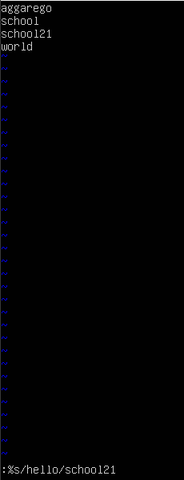
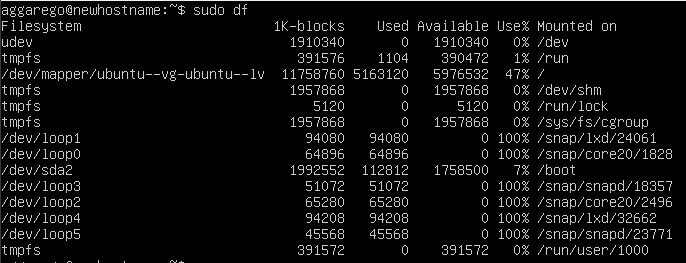
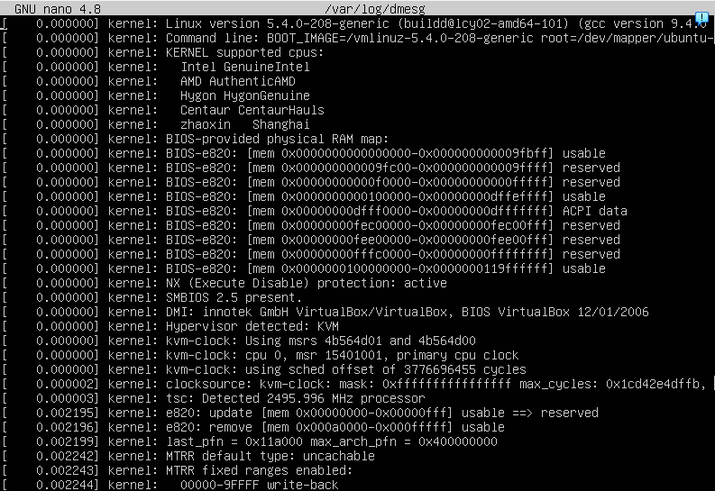
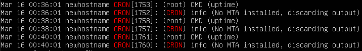

# REPORT

## Part 1. Установка ОС
* Установил Ubuntu 20.04 Server LTS без графического интерфейса.
* Узнал версию Ubuntu, выполнив команду ```cat /etc/issue```


## Part 2. Создание пользователя
* Создал пользователя, отличного от созданного при установке. Пользователь добавлен в группу adm.
* Новый пользователь есть в выводе команды
```cat /etc/passwd```


## Part 3. Настройка сети ОС
* Задал название машины вида user-1


* Установил временную зону, соответствующую моему текущему местоположению


* Вывел названия сетевых интерфейсов с помощью консольной команды


Здесь lo (также известный как loopback) -  виртуальный сетевой интерфейс, который используется для связи внутри самой системы без необходимости подключения к внешним ресурсам.
* Используя консольную команду ```hostname -I```, получил ip адрес устройства от DHCP-сервера 


DHCP (Dynamic Host Configuration Protocol) — это сетевой протокол, который автоматизирует процесс назначения IP-адресов и других параметров конфигурации для устройств, подключающихся к сети.
* Получил внешний ip-адрес шлюза (ip) с помощь команды ```curl 3ifconfig.me``` и внутренний IP-адрес шлюза командой ```ip route | grep default``` 


* с помощью ```sudo nano /etc/netplan/00-installer-config.yaml``` и ```sudo netplan apply```, задал статичные настройки ip, gw, dns (использовал публичный DNS-сервер 1.1.1.1). 


* Перезагрузил виртуальную машину. C помощью ```systemd-resolve --status``` убедился, что статичные сетевые настройки соответствуют заданным


* Пропинговал хосты 1.1.1.1 и ya.ru


 

В выводе команд есть «0% packet loss»
## Part 4. Обновление ОС
* Обновил системные пакеты до последней на момент выполнения задания версии. Сообщение о том, что обновления отсутствуют.


## Part 5. Использование команды sudo
* Разрешил пользователю, созданному в Part 2 (example_user),выполнять команду sudo. пользователь добавлен в sudo


* sudo ( superuser do) — это команда в Unix-подобных операционных системах, которая позволяет пользователям выполнять команды с правами суперпользователя (root) или другого пользователя. 
* Поменял hostname ОС от имени пользователя, созданного в пункте Part 2 (используя sudo), с помощью ```sudo hostnamectl set-hostname newhostname```.


## Part 6. Установка и настройка службы времени
* Вывел время часового пояса. Вывод команды ```timedatectl show``` содержит ```NTPSynchronized=yes```.


## Part 7. Установка и использование текстовых редакторов
* Установил текстовый редактор mcedit ```sudo apt install mcedit```


1. Vim
* Создал файл test_vim.txt, написал свой никнейм и закрыл с сохранением изменений(с помощью :wq)


* Открыл  файл на редактирование, заменил никнейм на строку «21 School 21», закрыл файл без сохранения изменений (с помощью :q!) 


* Отредактировал файл, использовал команду поиска ```/hello```, где hello - искомое слово 


* Использовал команду для замены слова на другое ```:%s/hello/school21```



* Аналогично выполнил для редакторов nano и mcedit 
2. nano

* 

 Для закрытия с сохранением - ctrl+x и y. 

* 

Для закрытия без сохранения - ctrl+x и n.

* 

 Для поиска - ctrl + w.

* 


 

Для замены - ```ctrl + \```, ввод заменяемого, ввод слова, на которое меняем
3. mcedit

*  

Для закрытия с сохранением - f2, save.

*  

для выхода без сохранения - f10, no

*  

Для поиска - f7, ок.

*  


Для замены f4, ввод слов, ок.

## Part 8. Установка и базовая настройка сервиса SSHD
* Установил службу SSHd с  помощью ```sudo apt install openssh-server```. 


* Добавил автостарт службы при загрузке системы. 


* Перенастроил службу SSHd на порт 2022.


* Используя команду ps, увидел процесс sshd. 


```-С``` - показывает процессы по имени команды(sshd).
* Перезагрузил систему и запустил ```netstat -tan``` 


* Ключи команды netstat -tan:
-t: Показывает только TCP-соединения.
-a: Показывает все соединения (как активные, так и ожидающие).
-n: Отображает адреса и порты в числовом формате (без попытки разрешения имён).
* Столбцы вывода команды:
Proto: Протокол (в данном случае tcp).
Recv-Q: Количество данных, ожидающих обработки в очереди приёма.
Send-Q: Количество данных, ожидающих отправки в очереди отправки.
Local Address: Локальный адрес и порт, на котором работает служба.
Foreign Address: Удалённый адрес и порт (для установленных соединений).
State: Состояние соединения (например, LISTEN, ESTABLISHED).
* 0.0.0.0 означает, что служба прослушивает все доступные сетевые интерфейсы (все IP-адреса на сервере).
Например, 0.0.0.0:2022 означает, что служба SSHd прослушивает порт 2022 на всех сетевых интерфейсах.
## Part 9. Установка и использование утилит top, htop
* Установил утилиты top и htop


* По выводу команды top определил


uptime - 1:21,
количество авторизованныхпользователей - 1,
среднюю загрузку системы - 0.00,
общее количество процессов - 104,
загрузку cpu - 0%, 100% простаивания(id),
загрузку памяти - 159.9,
pid процесса занимающего больше всего памяти - 694 (0,7%). 


pid процесса, занимающего больше всего процессорного времени - 675 (0,3%) 


* Вывод команды htop отсортированному по PID 


* PERCENT_CPU 


* PERCENT_MEM 


* TIME 


* отфильтрованному для процесса sshd 


* с процессом syslog, найденным, используя поиск 


* с добавленным выводом hostname, clock и uptime 


## Part 10. Использование утилиты fdisk
* Запусти команду fdisk -l


* Название жесткого диска - /dev/sda (VBOX HARDDISK), его размер - 25 GiB, количество секторов - 52428800, а также размер swap - 2.2 Gi.
## Part 11. Использование утилиты df
* Запустил команду df 



* Размер - 11758760, занято - 5163120, свободно - 5976532, используется - 47%, еденица измерения - 1 КБ.
* Запустил команду df -Th 


* Размер раздела - 12 G, занято - 5.0 G, свободно - 5.7 G, используется - 47%, тип файловой системы - ext4.
## Part 12. Использование утилиты du
* Запустил команду du 


*  Размер папок /home, /var, /var/log в байтах 


* размер папок /home, /var, /var/log в человекочитаемом виде 


* размер всего содержимого в /var/log (не общее, а каждого вложенного элемента в КБ, используя *) 


## Part 13. Установка и использование утилиты ncdu
* Установил утилиту ncdu 


* Размеры папок /home, /var, /var/log 


## Part 14. Работа с системными журналами
* Открыл для просмотра:
/var/log/dmesg, /var/log/syslog, /var/log/auth.log




* Последняя успешная авторизация: Mar 16, 00:08:11, имя пользователя aggarego, метод - pam_unix 
* Перезапустилл службу SSHd
```sudo systemctl restart ssh```


## Part 15. Использование планировщика заданий CRON
* Используя планировщик заданий, запустил команду uptime через каждые 2 минуты 


*  Строчки (минимум две в заданном временном диапазоне) о выполнении 



* Вывел на экран список текущих заданий для CRON. 


* Удалил все задания из планировщика заданий ```sudo crontab -r```. 


